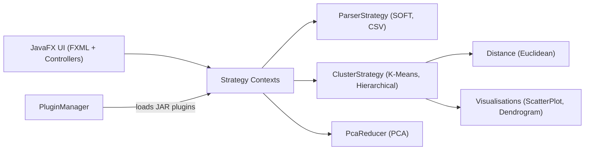

# Extensible Bioinformatics Clustering Platform

A **JavaFX desktop application for clustering and visualising high-dimensional biological data** (e.g. NCBI GEO gene-expression datasets) — built around a **plugin architecture** so new parsers, clustering algorithms, and visualisations can be added *without touching the core*.

Solo BSc Computer Science final-year project · Java · Maven · JavaFX.


---

## What it does

Load a biological dataset (GEO `.soft` gene-expression files or CSV), reduce it to a
visualisable space with **PCA**, cluster it with **K-Means** or **hierarchical clustering**,
and explore the result as an interactive **scatter plot** or **dendrogram**. Every one of
those stages — parsing, clustering, visualisation — is a **pluggable strategy**, so the tool
is a *framework* for clustering experiments rather than a single hard-coded pipeline.

## Features

- **Two clustering algorithms from scratch** — K-Means (configurable _k_, centroid init) and agglomerative **hierarchical clustering** with a dendrogram view.
- **PCA dimensionality reduction** (via Apache Commons Math) to project high-dimensional gene-expression data into 2D for visualisation.
- **Multi-format parsing** — NCBI GEO `.soft` gene-expression datasets and generic CSV, behind a common parser interface.
- **Interactive JavaFX UI** — guided view flow (welcome → pick data → choose method → visualise) with configuration dialogs per algorithm.
- **Plugin system** — drop-in `.jar` plugins for three extension points: **parsers, clustering algorithms, and visualisations**, discovered and loaded at runtime.
- **Tested** — JUnit 5 suite covering parsing, clustering, PCA, and the plugin manager.

## Architecture

The core is deliberately closed to modification but open to extension (Strategy + Plugin
patterns, MVC for the UI):



**Design patterns used:**
- **Strategy** — `ParserStrategy`, `ClusterStrategy`, and `Distance` let algorithms be swapped at runtime via their `*Context` classes.
- **Plugin / open–closed** — `PluginManager` + `PluginInterface` + `PluginType` load external `ParserPlugin` / `ClusteringPlugin` / `VisualizationPlugin` implementations from JARs.
- **MVC** — JavaFX FXML views + `*Controller` classes, separated from the model.
- **Observer** — views (`ScatterPlotView`, `DendrogramView`) observe clustering results.

**Package layout** (`src/main/java`):
- `model/` — parsing (`SoftParser`, `CSVParser`, `ParserContext`), clustering (`KmeansClustering`, `HierarchicalClustering`, `ClusterContext`), reduction (`PcaReducer`), core data types (`ParsedData`, `ClusteredData`, `ClusterNode`).
- `plugin/` — the extension framework (`PluginManager`, `PluginInterface`, `PluginType`, the three plugin contracts).
- `view/` + `controller/` — JavaFX UI, dialogs, and visualisations.
- `testPlugin/` — worked example plugins (`DummyCSVParser`, `DummyClusteringPlugin`, `DummyVisualizationPlugin`) that double as a how-to.

## Tech stack

**Java 17** · **JavaFX** (FXML UI) · **Maven** · **Apache Commons Math 3.6.1** (PCA/linear algebra) · **JUnit 5**.

## Getting started

### Prerequisites
- JDK **17** _(confirm against your `pom.xml` / `.classpath` and adjust)_
- Maven 3.8+
- JavaFX SDK _(if not resolved via Maven — set the version you used)_

### Build
```bash
git clone https://github.com/wildchild777/Extendible-Bioinformatics-Software.git
cd Extendible-Bioinformatics-Software
mvn clean install
```

### Run
The entry point is `TempMain`. Run it from your IDE (Eclipse project files are included),
or from the command line with JavaFX on the module path:
```bash
java --module-path "$PATH_TO_JAVAFX/lib" \
     --add-modules javafx.controls,javafx.fxml \
     -cp target/classes TempMain
```

Sample datasets are included under `src/main/resources/` (`GDS3310_full.soft`, `GDS4794_full.soft`) so you can try it immediately.

## Extending it with a plugin

The whole point of the framework: add capability without editing the core. To add, say, a new
clustering algorithm, implement `ClusteringPlugin`, package it as a `.jar`, and drop it in —
`PluginManager` discovers and loads it. See `testPlugin/DummyClusteringPlugin.java` and
`TestClusteringAlgorithm.java` for a minimal working example.

## Testing
```bash
mvn test
```
JUnit 5 tests cover clustering (`KmeansTest`, `HierarchicalClusteringTest`), parsing
(`SoftParserTest`, `ParserContextTest`), PCA (`PcaReducerTest`), and plugin loading (`PluginManagerTest`).

## Project context
Solo final-year project for BSc (Hons) Computer Science, Royal Holloway, University of London.
Design rationale and evaluation are in [`FYP F REPORT.pdf`](FYP%20F%20REPORT.pdf).

## Possible next steps
- More clustering algorithms (DBSCAN, GMM) — as plugins, no core changes.
- Additional distance metrics (cosine, Manhattan) via the `Distance` strategy.
- Export clustered results to CSV / image.
